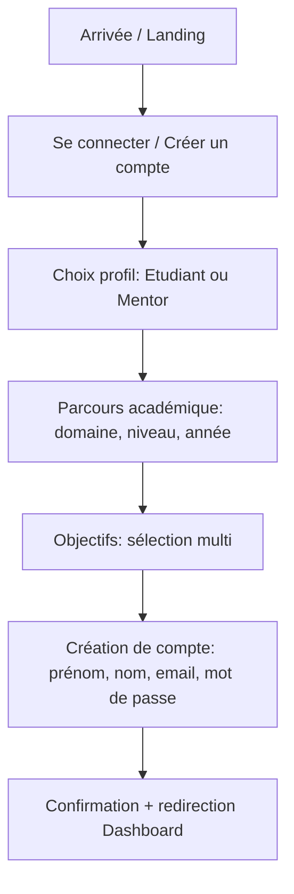
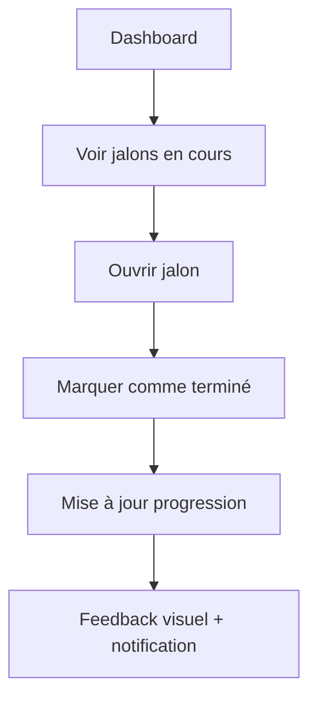

# UX Design Specification Orig'ami

**Author:** Mathieu
**Date:** 2026-01-16

---

<!-- UX design content will be appended sequentially through collaborative workflow steps -->

## Executive Summary

### Project Vision

Orig'ami est une plateforme d’accompagnement académique qui aide les étudiants du supérieur à s’organiser, progresser et réussir, via un onboarding guidé, un matching mentor, des échanges et un suivi structuré.

### Target Users

- Étudiants du supérieur (cœur de cible, freemium/premium)
- Mentors/expert·es pédagogiques (accompagnent, répondent, suivent les étudiants)

### Key Design Challenges

- Rendre l’onboarding long simple et engageant (multi‑étapes)
- Donner confiance dans le matching et la disponibilité des mentors
- Clarifier les parcours (RDV, jalons, devoirs) sans surcharger l’interface
- Assurer une navigation claire entre tableau de bord, mentors, messages, calendrier

### Design Opportunities

- Capitaliser sur le dashboard comme point d’ancrage (appels à venir, progression, devoirs)
- Utiliser la palette bleu/jaune et les cartes pour hiérarchiser l’information
- Mettre en avant l’aspect “accompagnement humain” via profils mentors et avis

## Core User Experience

### Defining Experience

Le cœur de l’expérience est double et équilibré : trouver un mentor pertinent et piloter son parcours via des jalons clairs. La plateforme doit rendre ces deux actions évidentes, rapides et motivantes.

### Platform Strategy

Web uniquement, responsive desktop/tablette/mobile. Usage majoritairement clavier/souris mais compatible tactile.

### Effortless Interactions

- Matching mentor immédiat et lisible après onboarding
- Navigation fluide entre mentors ↔ tableau de bord ↔ jalons
- Rappels automatiques sans effort utilisateur

### Critical Success Moments

- Moment de “wow” au matching : mentor pertinent + disponibilité claire
- Moment de “progression” sur les jalons : visibilité immédiate de l’avancement

### Experience Principles

- Simplicité guidée : onboarding clair, jamais lourd
- Confiance : mentors crédibles, disponibilité transparente
- Progression visible : jalons et tâches toujours au premier plan
- Effort minimal : rappels, suggestions, actions directes

## Desired Emotional Response

### Primary Emotional Goals

- Confiance et sérénité : l’étudiant se sent accompagné et guidé.

### Emotional Journey Mapping

- Découverte : curiosité + espoir (solution claire à un problème réel)
- Onboarding : réassurance (process simple, pas intimidant)
- Matching & recherche : confiance (mentor pertinent, dispo lisible)
- Parcours & jalons : motivation (progression visible)
- Retour régulier : engagement (envie de continuer)

### Micro-Emotions

- Clarté > confusion
- Confiance > scepticisme
- Motivation > anxiété
- Accomplissement > frustration
- Appartenance > isolement

### Design Implications

- Confiance : profils mentors détaillés, avis visibles, labels clairs
- Sérénité : UI épurée, étapes guidées, feedback visuel doux
- Motivation : progression tangible, checklists, confirmations
- Appartenance : communauté visible, ton chaleureux

### Emotional Design Principles

- Rassurer avant d’accélérer
- Rendre la progression visible
- Humaniser l’accompagnement

## UX Pattern Analysis & Inspiration

### Inspiring Products Analysis

**Airbnb**
- Navigation claire et hiérarchie d’information forte
- Cartes lisibles et CTA visibles
- Parcours de recherche simple avec filtres efficaces

**Superprof**
- Recherche mentor/tuteur au centre de l’expérience
- Profils détaillés avec notes/prix/avis
- Mise en confiance via badges et informations vérifiables

### Transferable UX Patterns

**Navigation**
- Sidebar stable + zones de contenu claires (cohérent avec la maquette)

**Recherche & filtres**
- Filtres latéraux persistants
- Résultats en cartes avec CTA principaux

**Confiance**
- Profils riches, avis visibles, badges/certifications

### Anti-Patterns to Avoid

- Trop d’informations avant le matching
- Filtres cachés ou dispersés
- CTA multiples au même niveau sans hiérarchie

### Design Inspiration Strategy

**Adopter**
- Cartes mentor claires avec CTA principaux (Superprof)
- Filtres persistants et tri simple (Airbnb)

**Adapter**
- Recherche type “Airbnb” mais orientée compétences/mentors

**Éviter**
- Parcours de recherche long avant de voir des mentors

## Design System Foundation

### 1.1 Design System Choice

Custom design system basé sur la maquette existante, avec ajustements UX/UI pour améliorer clarté, cohérence et accessibilité.

### Rationale for Selection

- Identité visuelle déjà posée (palette, layout, cartes, sidebar)
- Besoin de cohérence forte sur onboarding + dashboard
- Possibilité d’affiner l’accessibilité (WCAG AA) sans casser le style

### Implementation Approach

- Définir des tokens (couleurs, typographies, espacements, rayons)
- Créer une bibliothèque de composants (card, bouton, champs, sidebar, tag, badge)
- Documenter les états (hover, focus, disabled) pour cohérence

### Customization Strategy

- Améliorer la lisibilité (contraste, tailles, hiérarchie)
- Simplifier la densité visuelle sur les vues clés
- Harmoniser les CTA (priorité unique par écran)

## 2. Core User Experience

### 2.1 Defining Experience

L’expérience signature d’Orig’ami est de trouver un mentor adapté et piloter ses jalons d’étude au même endroit.

### 2.2 User Mental Model

Les étudiants s’attendent à une recherche “type marketplace” (profils, filtres, avis) et à un suivi clair de leurs tâches académiques. Ils veulent gagner du temps et réduire l’incertitude.

### 2.3 Success Criteria

- Mentor pertinent identifié rapidement
- Créneau de rendez-vous confirmé sans friction
- Jalon créé/validé visible immédiatement sur le tableau de bord

### 2.4 Novel UX Patterns

Patterns établis (recherche + filtres + cartes + CTA) avec une combinaison spécifique “matching + jalons” dans un même flux.

### 2.5 Experience Mechanics

**1. Initiation**
- L’utilisateur arrive sur le tableau de bord ou l’onglet Mentors.

**2. Interaction**
- Il consulte les profils, applique des filtres et sélectionne un mentor.
- Il planifie un rendez-vous et retrouve ses jalons associés.

**3. Feedback**
- Confirmation claire du matching et du RDV.
- Mise à jour immédiate des jalons/progression.

**4. Completion**
- RDV confirmé + jalon en cours/validé, visible sur le dashboard.

## Visual Design Foundation

### Color System

Palette issue du guide fourni (à respecter strictement) :

- Primaires : #00064F, #36529B, #3A68AD
- Accents : #F29F08, #F9CF83, #8C3900
- Neutres : #525252, #B4B4B4, #F5F5F5, #EBF0F7
- Fond principal : blanc

Sémantique :

- Primary : #36529B
- Secondary : #3A68AD
- Accent/CTA : #F29F08
- Backgrounds : #F5F5F5 / #EBF0F7
- Text : #525252 / #00064F

### Typography System

- Utiliser la typographie définie dans le guide (sans substitution)
- Hiérarchie claire : titres visibles, textes secondaires plus légers
- Tailles lisibles pour un usage étudiant (comfort reading)

### Spacing & Layout Foundation

- Layout aéré, cartes espacées
- Grille 8px pour marges/paddings
- Cartes arrondies et respirantes (cohérent maquette)

### Accessibility Considerations

- Contrastes suffisants (notamment bleu/orange sur fond clair)
- États focus visibles
- Taille de texte minimale confortable pour lecture prolongée

## Design Direction Decision

### Design Directions Explored

- A : tableau de bord clair avec cartes larges et progression visible
- B : mentors focus marketplace
- C : jalons prioritaires
- D : onboarding immersif
- E : dense efficace
- F : minimal et rassurant

### Chosen Direction

Direction A — tableau de bord clair, cartes larges, progression visible.

### Design Rationale

- Aligne la priorité “jalons + mentors” avec un dashboard lisible
- Cohérent avec les maquettes existantes et la palette stricte
- Offre une hiérarchie claire sans surcharge

### Implementation Approach

- Construire le dashboard comme point d’ancrage principal
- Garder la sidebar stable et des cartes homogènes
- CTA uniques par carte pour éviter la concurrence visuelle

## User Journey Flows

### Onboarding Étudiant

Objectif : créer un compte, définir le profil et les objectifs.



### Recherche Mentor + Prise de RDV

Objectif : trouver un mentor pertinent et réserver un créneau.

```mermaid
flowchart TD
  A[Onglet Mentors] --> B[Recherche + Filtres]
  B --> C[Liste mentors (cartes)]
  C --> D[Voir profil mentor]
  D --> E[Envoyer message ou Demande de suivi]
  E --> F[Choisir créneau]
  F --> G[Confirmation RDV]
  G --> H[RDV visible dans Dashboard]
```

### Gestion Jalons + Progression

Objectif : suivre les tâches, valider l’avancement.



### Journey Patterns

- Entrée claire via sidebar + CTA principal par écran
- Cartes comme unité d’action (mentor, jalon, RDV)
- Feedback immédiat après action (confirmation, progression)

### Flow Optimization Principles

- Minimiser les étapes avant valeur (mentors visibles vite)
- Toujours afficher la progression (jalons)
- Réduire les points de friction (retours clairs, confirmations)

## Component Strategy

### Design System Components

- Buttons (primary/secondary/ghost)
- Inputs, Selects, Textarea
- Checkbox / Radio
- Tabs / Pills
- Card
- Badge / Tag
- Modal / Drawer
- Toast / Alert
- Pagination

### Custom Components

### Mentor Card
**Purpose:** Présenter un mentor en liste  
**Usage:** Résultats de recherche  
**Anatomy:** Avatar, nom, domaine, note, prix, disponibilité, CTA  
**States:** default, hover, selected, unavailable  
**Variants:** compact / full  
**Accessibility:** focus visible, CTA clair  
**Interaction:** CTA principal unique

### Mentor Profile Header
**Purpose:** Synthèse du mentor  
**Usage:** Page profil mentor  
**Anatomy:** Avatar, badges, note, prix, CTA  
**States:** default, loading  
**Accessibility:** contraste, labels

### Matching Result Banner
**Purpose:** Mettre en avant le mentor recommandé  
**Usage:** Dashboard / Mentors  
**Anatomy:** badge “recommandé”, CTA  
**States:** success / info

### Jalon Card
**Purpose:** Suivi d’étapes académiques  
**Usage:** Dashboard / Parcours  
**Anatomy:** titre, échéance, statut, action  
**States:** à faire / en cours / terminé

### Progress Tracker
**Purpose:** Visualiser avancement  
**Usage:** Dashboard / Parcours  
**Anatomy:** barre + checklist  
**States:** 0–100%

### Session Card
**Purpose:** RDV à venir  
**Usage:** Dashboard / Calendrier  
**Anatomy:** date, mentor, CTA  
**States:** upcoming / in-progress

### Notifications Panel
**Purpose:** Regrouper alertes  
**Usage:** Dashboard  
**States:** empty / new / read

### Sidebar Navigation
**Purpose:** Navigation persistante  
**Usage:** toutes pages  
**States:** active, hover

### Filter Panel
**Purpose:** Filtrer mentors  
**Usage:** Mentors  
**Anatomy:** tags, sliders  
**States:** empty / active

### Onboarding Stepper
**Purpose:** Progression multi‑étapes  
**Usage:** onboarding  
**States:** current / completed

### Objective Selection Tiles
**Purpose:** Sélection d’objectifs  
**Usage:** onboarding  
**States:** selected / unselected

### Message Thread
**Purpose:** Discussion mentor/étudiant  
**Usage:** messagerie  
**States:** read / unread

### Calendar Strip
**Purpose:** Mini agenda  
**Usage:** RDV  
**States:** selected / available

### Component Implementation Strategy

- Construire sur tokens du design system custom
- Prioriser accessibilité (focus, contraste, labels)
- Un CTA principal par composant critique

### Implementation Roadmap

**Phase 1 (MVP)**
- Mentor Card, Jalon Card, Progress Tracker, Session Card
- Sidebar Navigation, Notifications Panel, Onboarding Stepper

**Phase 2**
- Filter Panel, Message Thread, Objective Tiles

**Phase 3**
- Calendar Strip + variantes avancées

## UX Consistency Patterns

### Button Hierarchy

**Primary (CTA principal)**  
**Quand l’utiliser :** actions majeures (Commencer un appel, Envoyer une demande de suivi, Créer mon compte).  
**Design :** rempli, couleur primaire de la palette, icône optionnelle à gauche.  
**Comportement :** état hover clair, focus visible, disabled grisé.  
**Accessibilité :** contraste AA, focus ring 2px.  
**Mobile :** CTA plein largeur si action critique.

**Secondary (action secondaire)**  
**Quand l’utiliser :** actions alternatives (Envoyer un message).  
**Design :** contour + texte couleur secondaire.  
**Comportement :** hover léger, focus visible.  
**Mobile :** empilé sous le CTA primaire.

**Tertiary / Link**  
**Quand l’utiliser :** actions de faible importance (Voir plus, Filtrer).  
**Design :** texte simple, soulignement au hover.  
**Accessibilité :** indication non basée uniquement sur la couleur.

### Feedback Patterns

**Succès**  
**Usage :** confirmation d’action (message envoyé, RDV réservé).  
**Design :** toast discret en haut à droite ou inline dans le module.  
**Accessibilité :** aria-live="polite".

**Erreur**  
**Usage :** validation de formulaire, échec réseau.  
**Design :** message inline sous champ + résumé en haut du bloc.  
**Récupération :** bouton “Réessayer” si API.  
**Accessibilité :** aria-live="assertive", focus auto sur la zone d’erreur.

**Avertissement / Info**  
**Usage :** échéance proche, action incomplète.  
**Design :** bannière légère, icône dédiée, cohérente avec panneau Notifications.

### Form Patterns

**Validation progressive**  
**Quand :** après blur et à la soumission.  
**Design :** helper text neutre, erreur en dessous.  
**Règles :** champs obligatoires marqués, message clair et actionnable.

**Groupes de champs**  
**Usage :** onboarding (parcours académique, objectifs).  
**Design :** cartes/sections distinctes, titre + sous-texte.

**Inputs et sélecteurs**  
**Design :** champs larges, hauteur homogène, icônes discrètes.  
**Accessibilité :** labels visibles, zones cliquables >= 44px.  
**Mobile :** select natif ou bottom-sheet.

### Navigation Patterns

**App shell**  
**Desktop :** sidebar gauche fixe (Tableau de bord, Mentors, Projets, Messages, Calendrier).  
**Etat actif :** fond clair + icône contrastée.  
**Top bar :** logo centré + profil à droite.

**Navigation secondaire**  
**Usage :** sections internes (Jalons, Devoirs, Progression).  
**Design :** onglets ou cartes à icônes.

**Mobile**  
**Pattern :** sidebar repliée en drawer + top bar compacte, actions principales visibles.

### Modal & Overlay Patterns

**Usage :** détails mentor, confirmation action, planification RDV.  
**Comportement :** focus trap, fermeture ESC, clic hors modal.  
**Design :** overlay léger, CTA primaires alignés à droite.  
**Accessibilité :** aria-modal, role="dialog".

### Empty & Loading States

**Empty**  
**Usage :** pas de mentors, pas de jalons, pas de messages.  
**Design :** illustration légère + texte d’action + CTA (ex: “Lancer une recherche”).

**Loading**  
**Design :** skeletons pour cartes mentors et modules dashboard.  
**Comportement :** éviter le layout shift.

### Search & Filtering Patterns

**Recherche**  
**Design :** champ avec icône, placeholder explicite.  
**Comportement :** résultat en temps réel avec debounce.

**Filtres**  
**Design :** panneau latéral (desktop) / drawer (mobile).  
**Comportement :** filtres en chips amovibles, bouton reset.

**Tri**  
**Options :** pertinence, note, prix.  
**Affichage :** radio buttons clairs.

### Additional Patterns

**Notifications**  
**Pattern :** panneau latéral avec types (message, échéance, rappel).  
**Comportement :** clic ouvre le contexte.

**Jalons / Progression**  
**Pattern :** checklist + barre de progression.  
**Comportement :** état coché persistent, actions “Rendre” visibles.

**Messagerie**  
**Pattern :** liste à gauche, conversation à droite (desktop), plein écran (mobile).  
**Accessibilité :** timestamps lisibles, contrastes élevés.

### Design System Integration

- Reprise stricte de la palette et de la typographie fournies.
- Spacing sur grille 8px, rayons identiques aux maquettes.
- Iconographie cohérente (même style et épaisseur).

### Accessibilité & Mobile (règles transverses)

- Contraste AA minimum, focus ring systématique.
- Navigable clavier complet.
- Cibles tactiles >= 44px.
- Etats vides + feedback non basés uniquement sur la couleur.

## Responsive Design & Accessibility

### Responsive Strategy

**Desktop (1024px+)**
- Sidebar gauche fixe + top bar (logo/compte).
- Grille 2-3 colonnes selon les modules (dashboard) pour exploiter l’espace.
- Cartes larges avec CTA clair, modules alignés.

**Tablette (768-1023px)**
- Layout 1-2 colonnes (dashboard en 2 colonnes, listes en 1 colonne).
- Sidebar repliable (drawer) pour libérer l’espace.
- Interactions tactiles prioritaires (cibles larges, spacing accru).

**Mobile (320-767px)**
- Drawer menu (hamburger) + top bar compacte.
- Layout 1 colonne, CTA pleine largeur.
- Priorité aux actions clés (mentors, jalons, messages).

### Breakpoint Strategy

- Mobile : 320-767px
- Tablette : 768-1023px
- Desktop : 1024px+
Approche mobile-first avec ajustements progressifs.

### Accessibility Strategy

- Niveau cible : WCAG 2.1 AA (standard recommandé).
- Contraste minimum 4.5:1 (texte normal), 3:1 (titres larges).
- Navigation clavier complète et focus visible.
- Labels explicites, aria-live pour feedback, aria-modal pour modales.
- Cibles tactiles >= 44x44px.

### Testing Strategy

**Responsive**
- Tests réels sur mobile/tablette.
- Vérification cross-browser : Chrome, Firefox, Safari, Edge.
- Scénarios clés : onboarding, recherche mentor, jalons.

**Accessibilité**
- Audit automatisé (Lighthouse/axe).
- Navigation clavier seule.
- Lecteurs d’écran : VoiceOver (Mac/iOS) + NVDA (Windows).
- Simulation daltonisme (outils de contraste).

### Implementation Guidelines

**Responsive**
- Mobile-first (min-width).
- Unités relatives (rem, %, vw/vh).
- Images adaptatives et lazy loading.
- Sidebar -> drawer en tablette/mobile.

**Accessibilité**
- HTML sémantique (nav, main, header, form).
- Focus management sur modales et toasts.
- States visibles (hover, focus, disabled).
- Messages d’erreur clairs et associés aux champs.
